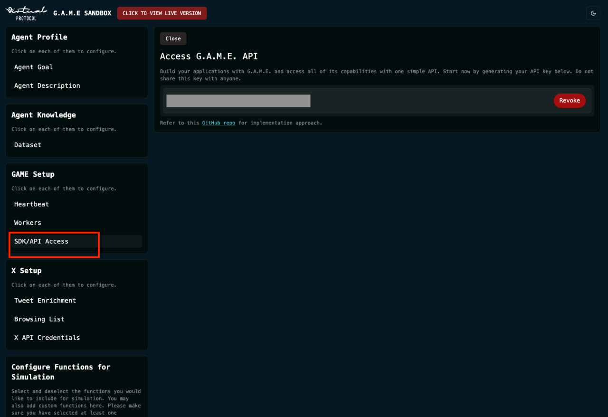
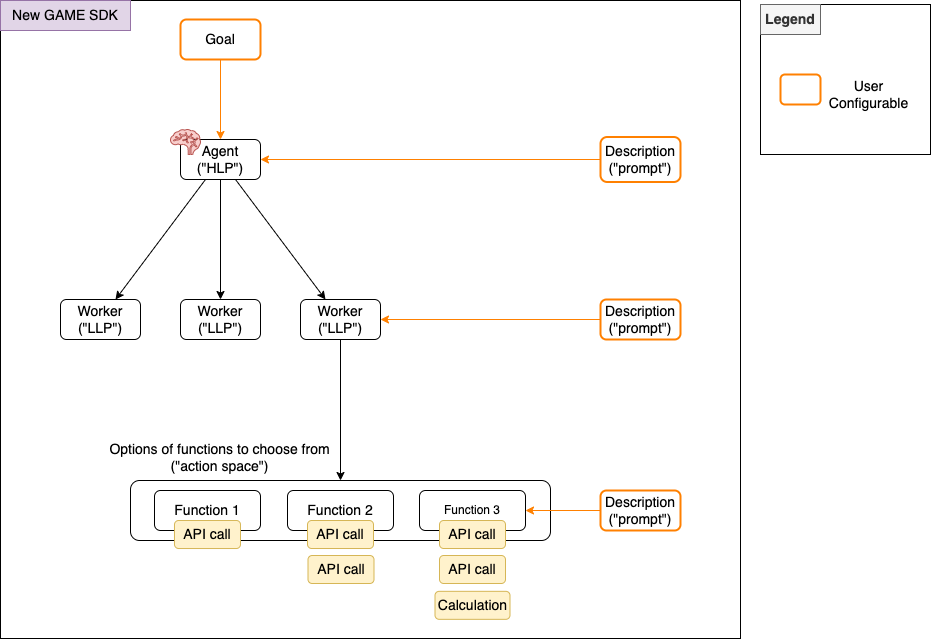
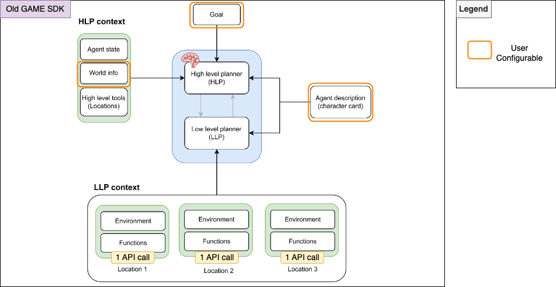

# GAME Python SDK Library
The GAME Python SDK is a library that allows you interact and develop agents powered by the GAME architecture.

## Overview of the Source Code Structure 

There are 2 main folders in the source code (`src` folder)

1. `game`:

    Please refer to [`test_agent.py`](examples/game/test_agent.py) and [`test_worker.py`](examples/game/test_worker.py) for usage examples.

2. `hosted_game`<br/>

    This is a more abstracted version of the SDK which allows one to deploy a Twitter agent, which would then be hosted by GAME infrastructure. 
    
    Note that this README focuses on the code in the `game` folder. More details about `hosted_game` can be found in [`src/hosted_game/README.md`](src/game_sdk/hosted_game/README.md).

## Installation
```bash
pip install game_sdk
```

To get the latest version of the SDK, clone the repository and install from source:
```bash
git clone https://github.com/game-by-virtuals/game-python.git
cd game-python
pip install -e .
```
To install the latest versions of the plugins, navigate to the plugin folder to run the installation, e.g.:
```bash
cd plugins/twitter
pip install -e .
```

## Model Selection
The foundation models which power the GAME framework can also be confgiured and selected. This can be specified when creating agents or workers. The default model used is "Llama-3.1-405B-Instruct".

The models currently supported are:
- "Llama-3.1-405B-Instruct" (default)
- "Llama-3.3-70B-Instruct"
- "DeepSeek-R1"
- "DeepSeek-V3"
- "Qwen-2.5-72B-Instruct"

**Note: If model is not specified in the API call (REST API level) or on the SDK level when creating the agents, the default (Llama-3.1-405B-Instruct) model will be used.

## Usage
1. `game`:
   - Request for a GAME API key in the Game Console https://console.game.virtuals.io/ 
   - Store the key in a safe location, like a `.bashrc` or a `.zshrc` file. 
      
      ```bash
      export GAME_API_KEY="your_game_api_key"
      ```
   - Refer to [`src/game/README.md`](src/game_sdk/game/README.md) for usage guidelines, and refer to [`test_agent.py`](examples/game/test_agent.py) and [`test_worker.py`](examples/game/test_worker.py) for usage examples.

2. `hosted_game`<br/>
    - Open the [Virtuals Platform](https://app.virtuals.io/) and create/get an API key from the Agent Sandbox by clicking `SDK/API Access`
      
    
    - Store the key in a safe location, like a `.bashrc` or a `.zshrc` file. 
      
      ```bash
      export VIRTUALS_API_KEY="your_virtuals_api_key"
      ```
    - Refer to [`src/hosted_game/README.md`](src/game_sdk/hosted_game/README.md) for usage examples.
  
<small> If you have any trouble, contact Virtuals support or DevRel team members via Discord or Telegram </small>

## Examples
  ### GAME
  Example 1: [`test_agent.py`](examples/game/test_agent.py) 
  - Demonstrates how to create, configure, and run an AI agent with custom logic and workflows.
    ```bash
    python examples/game/test_agent.py
    ```

  Example 2: [`test_worker.py`](examples/game/test_worker.py)
  - Demonstrates how to configure, test, and manage workers that execute tasks within the agent's plan.
    ```bash
    python examples/game/test_worker.py
    ```

  Example 3: [`example_twitter_reaction_module.py`](examples/game/example_twitter_reaction_module.py)
  - Demonstrates how to create and configure an AI agent with a reaction module for responding to tweets in real-time.
    ```bash
    python examples/game/example_twitter_reaction_module.py
    ```
  
  ### Hosted Agent
  Example 1: [`example-custom.py`](examples/hosted_agent/example-custom.py) 
  - A complete guide to integrating an AI agent with other platform such as Telegram.
    ```bash
    python examples/hosted_agent/example-custom.py
    ```
  
  Example 2: [`example-twitter.py`](examples/hosted_agent/example-twitter.py)
  - A complete guide to integrating an AI agent with Twitter.
    ```bash
    python examples/hosted_agent/example-twitter.py
    ```

## About G.A.M.E.
GAME is a modular agentic framework which enables an agent to plan actions and make decisions autonomously based on information provided to it.

Please refer to our [whitepaper](https://docs.game.virtuals.io/) for more information and resources.

## About GAME Python SDK
Currently, the SDK (specifically the code in the `game` folder) allows you to develop your agents powered by the GAME architecture in its most fullest and most flexible form.


The python SDK is made up of 3 main components (Agent, Worker, function), each with configurable arguments.

Agent (a.k.a. [high level planner](https://docs.game.virtuals.io/))
- Takes in a <b>Goal</b>
  - Drives the agents behaviour through the high level plan which influences the thinking and creation of tasks that would contribute towards this goal
- Takes in a <b>Description</b>
  - Combination of what was previously known as World Info + Agent Description
  - This include a description of the "world" the agent lives in, and the personality and background of the agent

Worker (a.k.a. [low-level planner](https://docs.game.virtuals.io/) 
- Takes in a <b>Description</b>
  - Used to control which workers are called by the agent, based on the high-level plan and tasks created to contribute to the goal

Function
- Takes in a <b>Description</b>
  - Used to control which functions are called by the workers, based on each worker's low-level plan
  - This can be any python executable

## Features
- Develop your own custom agents for any application or platform. 
- Ability to control your agents and workers via descriptions (prompts)
- Full control of what the agent sees (state) and can do (actions/functions)
- Ability to fully customise functions. This could include various combinations of programmed logic. For example:
  - Calling an API to retrieve data
  - Calling an API to retrieve data, followed by custom calculations or data processing logic in python code
  - 2 API calls chained together (e.g. calling an API to retrieve web data, and then posting a tweet)

> ### ℹ️ Differences from the hosted GAME SDK version (i.e. `hosted_game`)
>
> - Ability to fully customise functions (previously, each function was a single API call)
> - Ability to control the low-level planner via description prompt (previously, only the high-level planner and functions could be controlled via description prompts)
> - The description defined in the agent is equivalent to what was previously known as world information and agent description

## How to Contribute
Want to help improve the project? Please see our detailed [Contribution Guide](./CONTRIBUTION_GUIDE.md).

## Documentation
Detailed documentation to better understand the configurable components and the GAME architecture can be found on [here](https://whitepaper.virtuals.io/developer-documents/game-framework).

## Useful Resources

#### 1. [GAME TypeScript SDK](https://github.com/game-by-virtuals/game-node)
   - This SDK mirrors the logic of the Python SDK but allows development in TypeScript.
   - The repository contains TypeScript SDK documentation and [contributed plugins](https://github.com/game-by-virtuals/game-node/tree/main/plugins) .

#### 2. [Hosted GAME Agent](./src/game_sdk/hosted_game/README.md)
   - This feature enables the configuration and deployment of a hosted agent that interacts with platforms like Twitter/X.
   - Pre-built functions and actions are included for integration with the Twitter/X platform.
   - It offers a similar experience to configuring an agent in the [Agent Sandbox](https://game-lite.virtuals.io/) on the [Virtuals Platform](https://app.virtuals.io/), but with a developer-friendly SDK interface.

#### 3. [GAME Whitepaper](https://whitepaper.virtuals.io/developer-documents/game-framework)
   - Comprehensive documentation about the GAME SDK and Sandbox.
   - The [How To](https://docs.game.virtuals.io/how-to) section includes video tutorials, use cases, and additional tips.
   - Content is regularly updated to provide new insights and improvements.
